#  [KWGT Widgets](https://aumgupta.github.io/KWGT-Widgets/)


---

This repository hosts a collection of custom [**KWGT widgets**](https://aumgupta.github.io/KWGT-Widgets/). New widgets will be added periodically as the collection evolves.

> [!NOTE]
> Star this repository to stay updated on our progress! The widgets are actively being developed, and we welcome and appreciate contributions. All widgets are fully **unlocked** and **customizable**.

## Installation (Android)

1. **Download:**  
    - Go to the `widgets` folder and download the `.kwgt` files (optionally move them to `Kwgt/Kustom/widgets`).  
    - Download the custom font from the `fonts` folder (if requiered).

2. **Import:**  
    - Add a KWGT widget to your home screen.  
    - Open KWGT, select **Load Preset**, and import the downloaded `.kwgt` file (skip if already in `Kwgt/Kustom/widgets`).

<details>
  <summary>Click to see instructions on installaiton via Computer.</summary>

1. **Download the files**:
   - Clone or download the repository:
     ```bash
     git clone https://github.com/AumGupta/KWGT-Widgets.git
     ```
   - Alternatively, download the repository as a `.zip` file from the GitHub page and extract it.
2. **Transfer to your Android device**:
   - Connect your device to your computer via USB or use a file transfer tool.  
   - Copy the `.kwgt` files from the `Widgets` folder to your device's storage at `Kwgt/Kustom/widgets`.  
   - If applicable, copy the custom font file (`.ttf` or `.otf`) to your device at `Kwgt/Kustom/fonts`.  
3. **Import into KWGT**:
   - Follow the same steps as [above](#for-android-users) for importing into the KWGT app and applying the font.
</details>

---

## Widget Gallery

> [!TIP]
> Visit the [**website**](https://aumgupta.github.io/KWGT-Widgets/) for better view of all the widgets. Detailed information about the widgets can be then found in the following.

### New `INTERSTELLAR` themed widgets added!

- ### [Interstellar Analog Khaki Field Murph Auto](widgets/Interstellar_Analog_Khaki_Field_Murph_Auto.kwgt)
  > 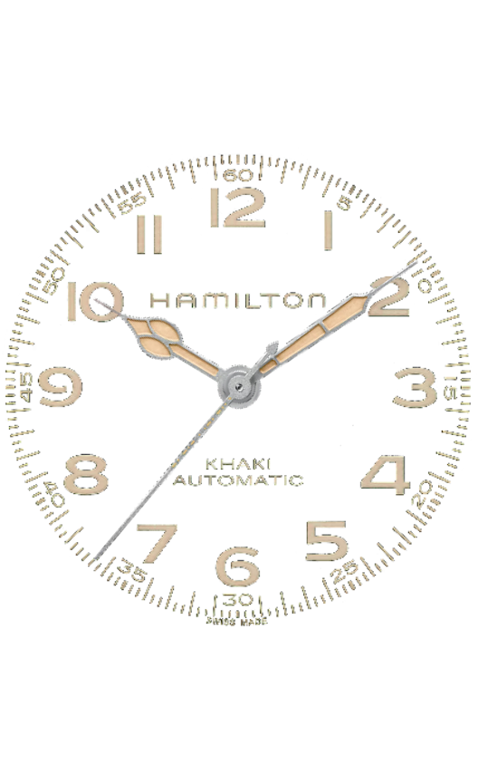
  >
  > My favorite Interstellar widget! It is the Hamilton Khaki Field Murph Auto Widget.
  > 
  > **Key Feature:** Resizable (No scaling, everything adjusts as per widget dimensions).

- ### [Interstellar Endurance](widgets/Interstellar_Endurance.kwgt)
  > | 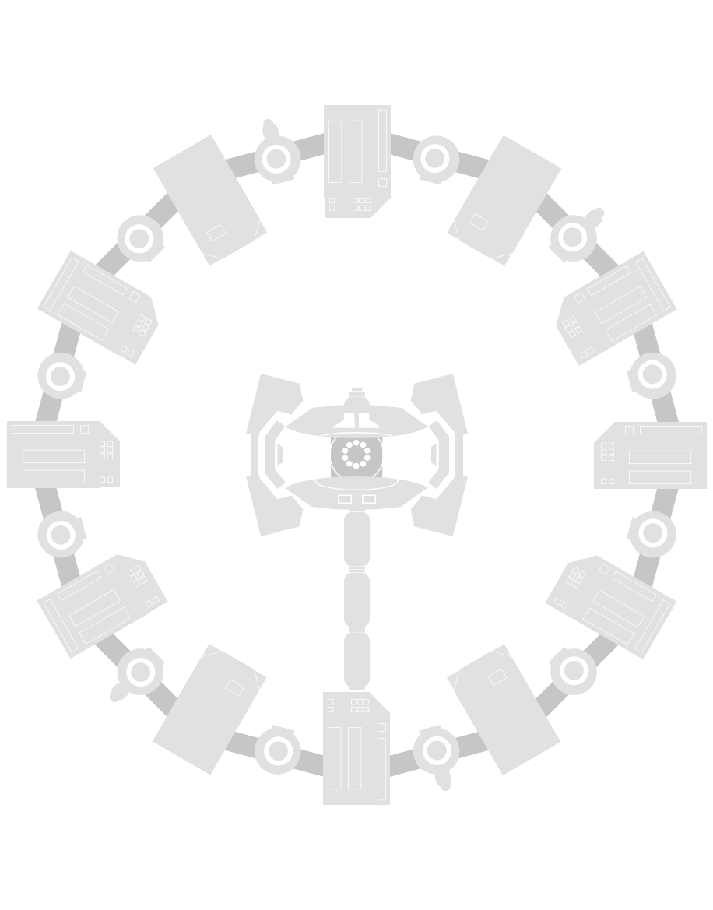 | 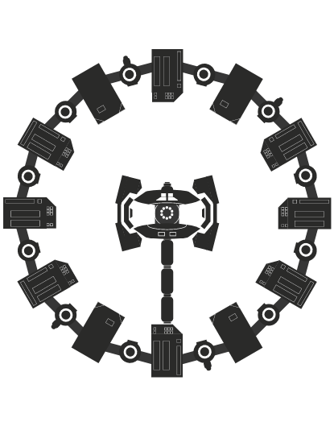 |
  > |-------|------|
  > | Light | Dark |
  >
  > Straight out of INTERSTELLAR, a rotating Endurance Widget which is the interplanetary spacecraft built by NASA as part of Project Endurance.
  > 
  > **Key Feature:** Automatically adapts to wallpaper color (Light if wallpaper is dark and vice versa).

- ### [Interstellar Endurance Analog](widgets/Interstellar_Endurance_Analog.kwgt)
  > | 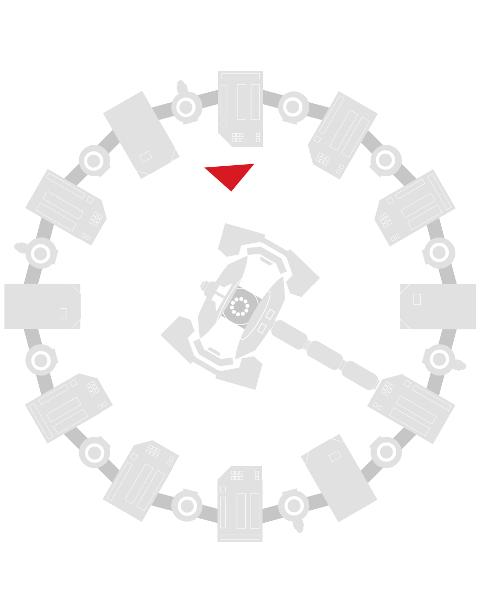 | 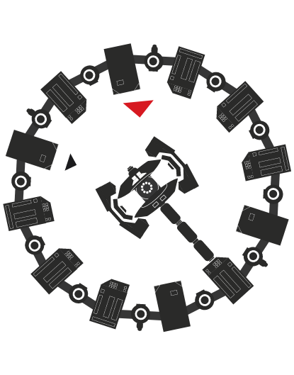 |
  > |-------|------|
  > | Light | Dark |
  >
  > Analog clock with Endurance spacecraft acting as the seconds hand. Hours and minutes reflected bt small triangle indicators.
  > 
  > **Key Feature:** Automatically adapts to wallpaper color.

- ### [Interstellar Endurance Analog 2](widgets/Interstellar_Endurance_Analog_2.kwgt)
  > 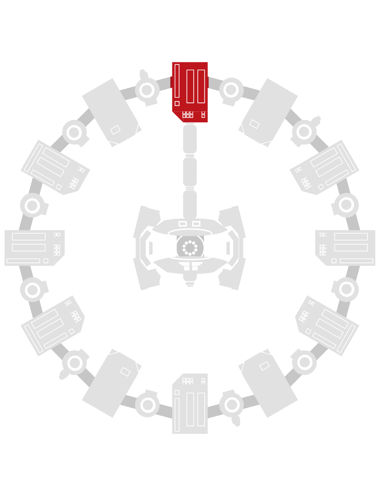
  >
  > No rotation in the Endurance as now it acts as the dial of the clock, each module corresponding to hours.
  > 
  > **Key Features:** 
  > - The color of the module changes to red for corresponding hour value.
  > - Minutes indicated by a triangular minute hand.

- ### [Interstellar Analog](widgets/Interstellar_Analog.kwgt)
  > 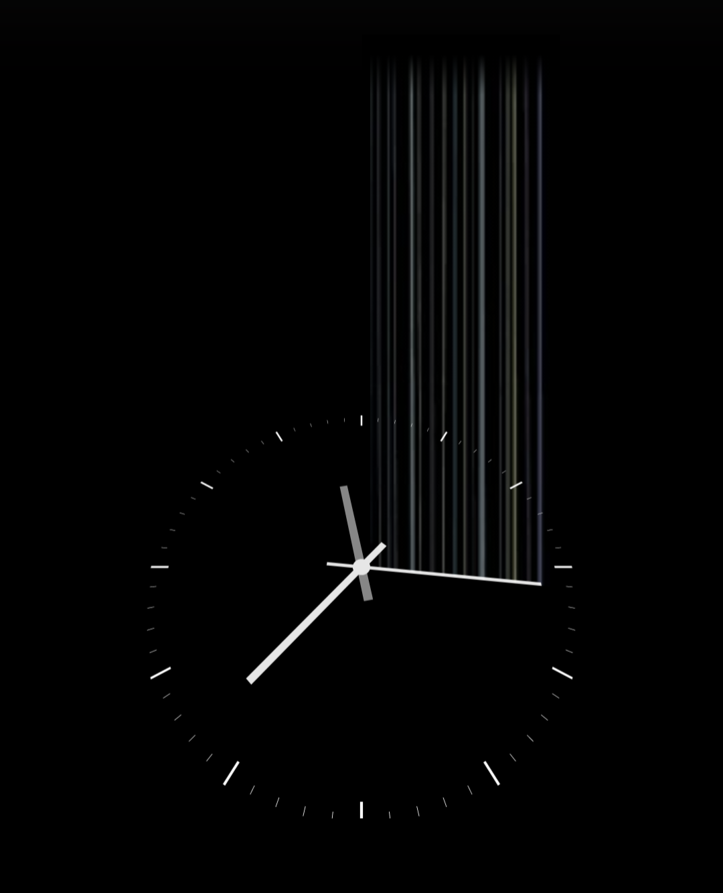
  >
  > A 3D-tilted clock widget inspired by Interstellar, where gravitational waves manipulate the second hand to bridge communication between dimensions, symbolizing the link between gravity and time inside the tesseract
  > 
  > **Note:** I am still perfecting this one. If you have any other ideas to improve this one, I'd love to see them. I never lock these, so go ahead and modify.

  More INTERSTELLAR themed widgets coming soon!

---

### **`NOTHING OS`** Inpired widgets ahead!

- ### [Nothing Analog ](widgets/Nothing_Analog_.kwgt)
  > | 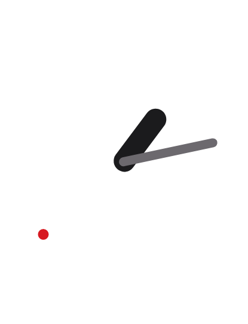 | 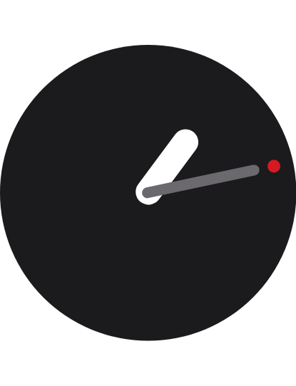 |
  > |-------|------|
  > | Light | Dark |
  >
  > Nothing OS themed Analog clock widget with dynamic themes.
  > 
  > **Key Feature:** Automatically adapts to system theme.

- ### [Nothing Analog 2](widgets/Nothing_Analog_2.kwgt)
  > | 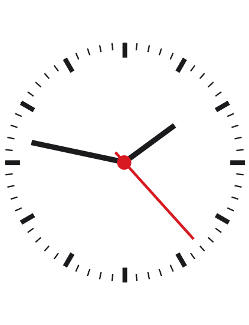 | 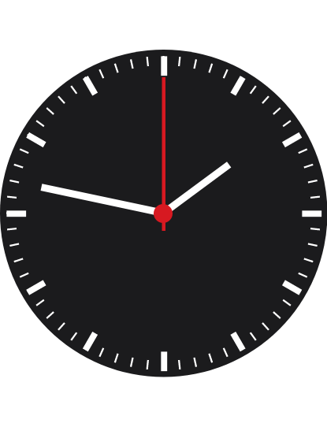 |
  > |-------|------|
  > | Light | Dark |
  >
  > Nothing OS themed Analog clock widget with dynamic themes.
  > 
  > **Key Feature:** Automatically adapts to system theme.

- ### [Nothing Analog 3](widgets/Nothing_Analog_3.kwgt)
  > | 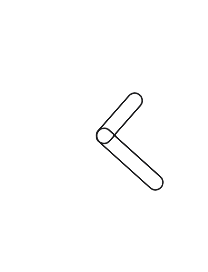 | 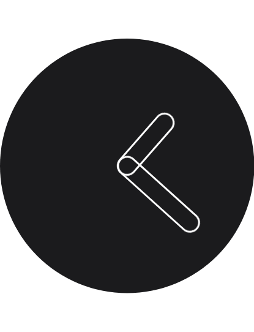 |
  > |-------|------|
  > | Light | Dark |
  >
  > Nothing OS themed Analog clock widget with dynamic themes.
  > 
  > **Key Feature:** Automatically adapts to system theme.

- ### [Nothing Analog 5](widgets/Nothing_Analog_5.kwgt)
  > | 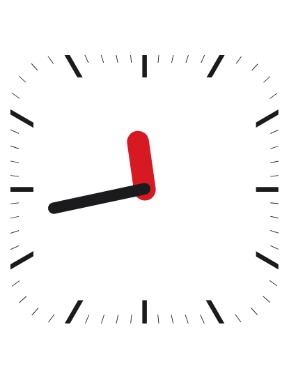 | 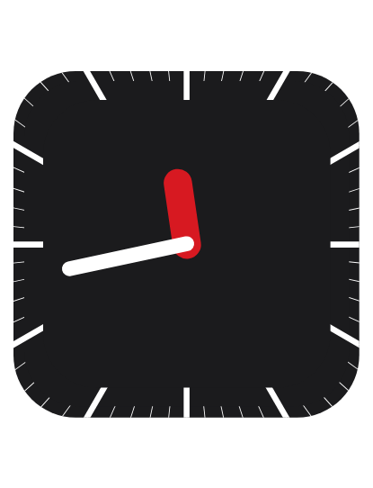 |
  > |-------|------|
  > | Light | Dark |
  >
  > Nothing OS themed Analog clock widget with dynamic themes.
  > 
  > **Key Feature:** Automatically adapts to system theme.

- ### [Nothing Analog 5 Transparent](widgets/Nothing_Analog_5_Transparent.kwgt)
  > | 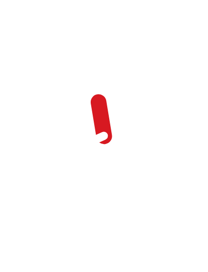 | 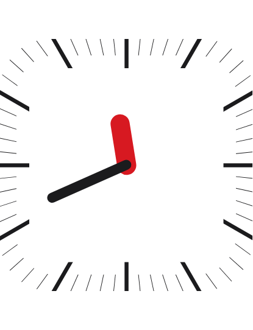 |
  > |-------|------|
  > | Light | Dark |
  >
  > Nothing OS themed Transparent analog clock widget with dynamic themes.
  > 
  > **Key Feature:** Automatically adapts to wallpaper color Dark/Light [Note: Needs to be refreshed after changing wallpaper].

- ### [Nothing Battery](widgets/Nothing_Battery.kwgt)
  > 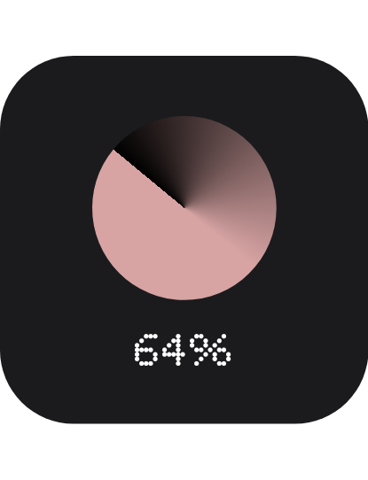
  >
  > Nothing OS themed battery widget with dynamic themes.
  > 
  > **Key Feature:** Automatically adapts to system theme.

- ### [Nothing Battery2](widgets/Nothing_Battery2.kwgt)
  > | 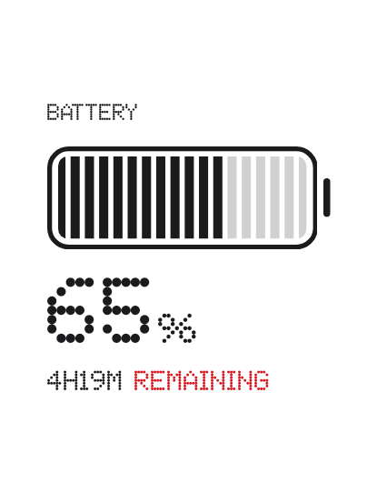 | 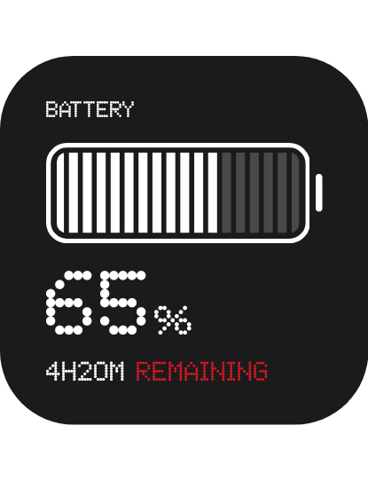 |
  > |-------|------|
  > | Light | Dark |
  >
  > Nothing OS themed battery widget with dynamic themes.
  > 
  > **Key Feature:** Automatically adapts to system theme.

- ### [Nothing Battery Mini](widgets/Nothing_Battery_Mini.kwgt)
  > | 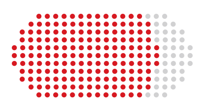 | 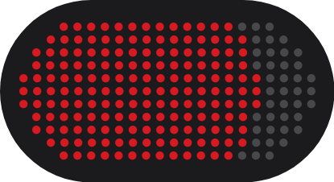 |
  > |-------|------|
  > | Light | Dark |
  >
  > Nothing OS themed Mini Battery widget with dynamic themes.
  > 
  > **Key Feature:** Automatically adapts to system theme.

- ### [Nothing CPU](widgets/Nothing_CPU.kwgt)
  > | 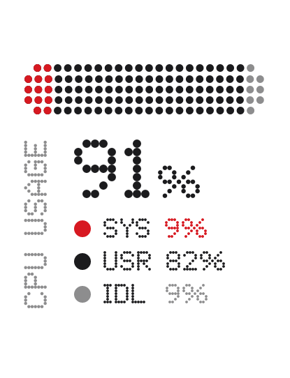 | 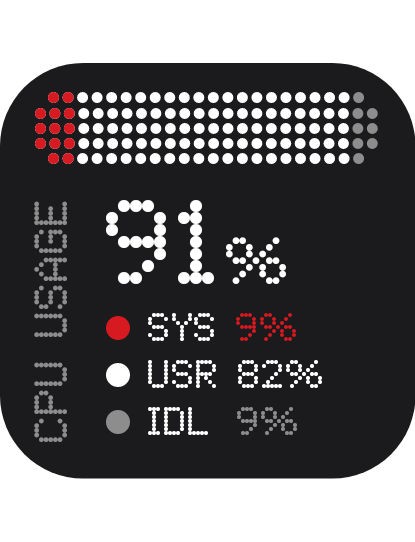 |
  > |-------|------|
  > | Light | Dark |
  >
  > Nothing OS themed CPU Monitor widget that shows sytem, user and idle percentages with dynamic themes.
  > 
  > **Key Feature:** Automatically adapts to system theme.

- ### [Nothing Date Time](widgets/Nothing_Date_Time.kwgt)
  > | 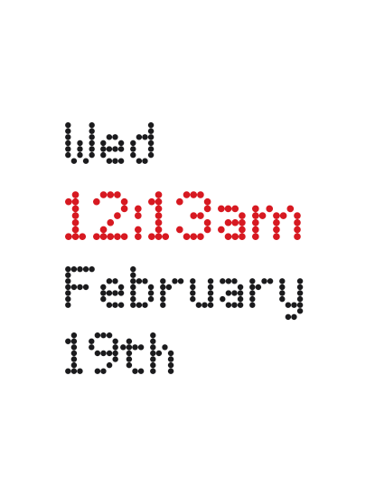 | 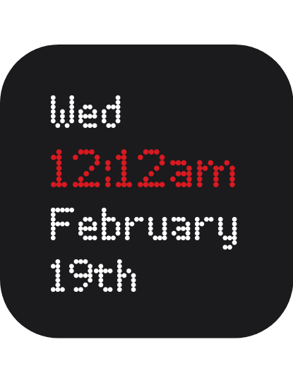 |
  > |-------|------|
  > | Light | Dark |
  >
  > Nothing OS themed minimal date-time widget with dynamic themes.
  > 
  > **Key Feature:** Automatically adapts to system theme.

- ### [Nothing Date Time2](widgets/Nothing_Date_Time2.kwgt)
  > | 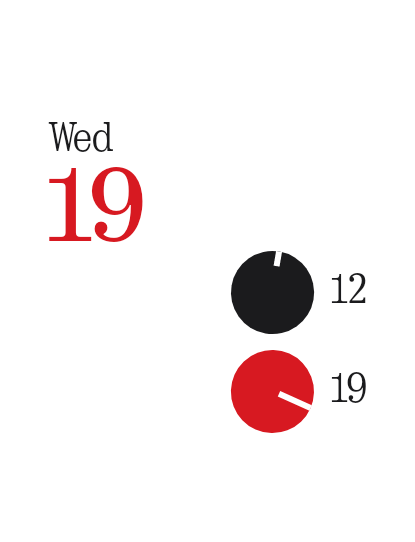 | 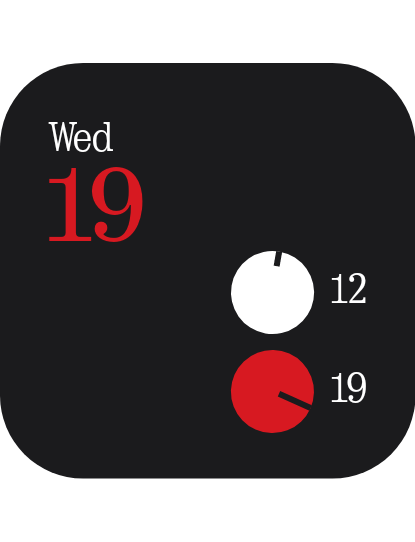 |
  > |-------|------|
  > | Light | Dark |
  >
  > Nothing OS themed date-time widget with dynamic themes.
  > 
  > **Key Feature:** Automatically adapts to system theme.

- ### [Nothing Date Time3](widgets/Nothing_Date_Time3.kwgt)
  > | 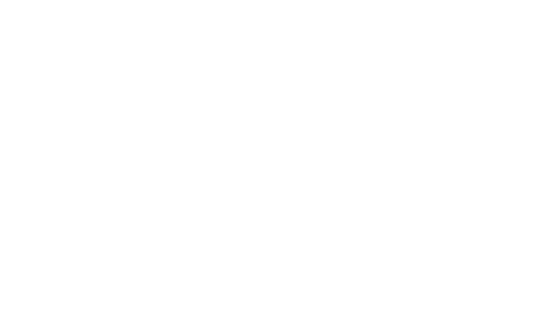 | 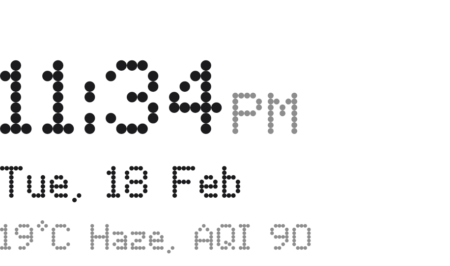 |
  > |-------|------|
  > | Light | Dark |
  >
  > Nothing OS themed date-time+Temperatur+AQI widget with dynamic themes.
  > 
  > **Key Feature:** Automatically adapts to wallpaper color Dark/Light [Note: Needs to be refreshed after changing wallpaper]..

- ### [Nothing Digital](widgets/Nothing_Digital.kwgt)
  > | 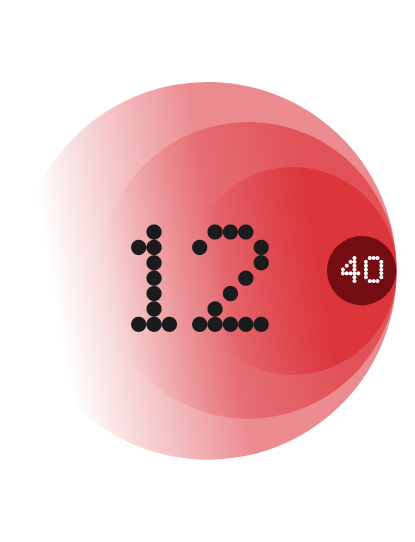 | 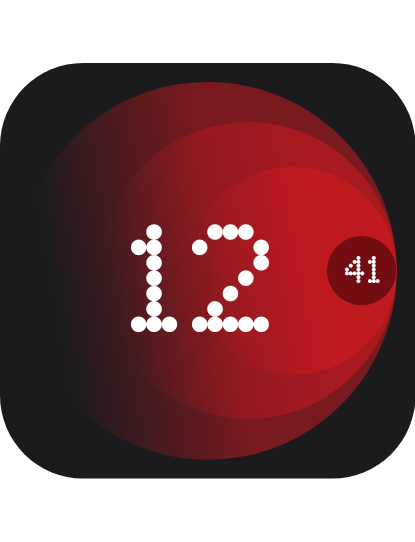 |
  > |-------|------|
  > | Light | Dark |
  >
  > Nothing OS themed Digital Clock widget with dynamic themes.
  > 
  > **Key Feature:** Automatically adapts to system theme.

- ### [Nothing Digital2](widgets/Nothing_Digital2.kwgt)
  > | 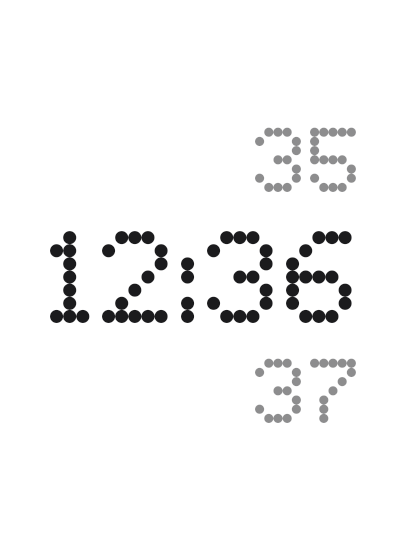 | 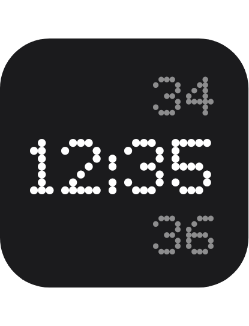 |
  > |-------|------|
  > | Light | Dark |
  >
  > Nothing OS themed Digital Clock widget with dynamic themes.
  > 
  > **Key Feature:** Automatically adapts to system theme.

- ### [Nothing Digital3](widgets/Nothing_Digital3.kwgt)
  > | 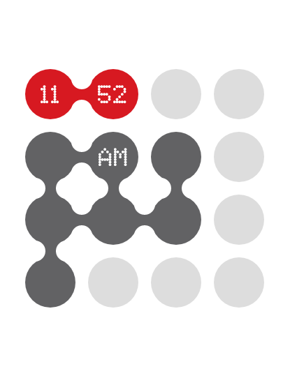 | 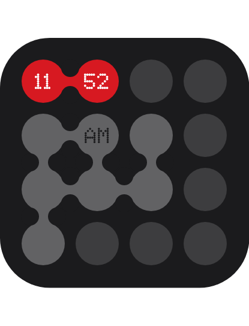 |
  > |-------|------|
  > | Light | Dark |
  >
  > Nothing OS themed Digital Clock widget with dynamic themes.
  > 
  > **Key Feature:** Automatically adapts to system theme.

- ### [Nothing Digital4](widgets/Nothing_Digital4.kwgt)
  > | 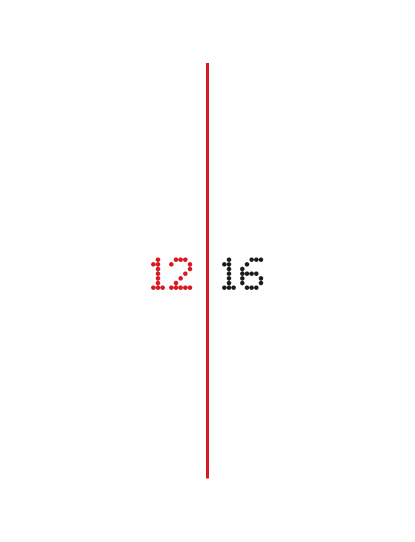 | 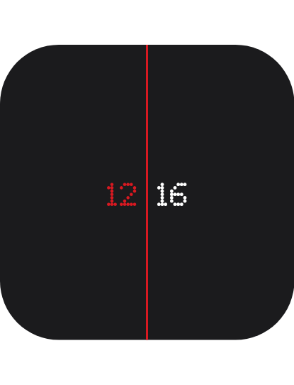 |
  > |-------|------|
  > | Light | Dark |
  >
  > Nothing OS themed digital clock widget with dynamic themes.
  > 
  > **Key Feature:** Automatically adapts to system theme.

- ### [Nothing Digital Clock](widgets/Nothing_Digital_Clock.kwgt)
  > | 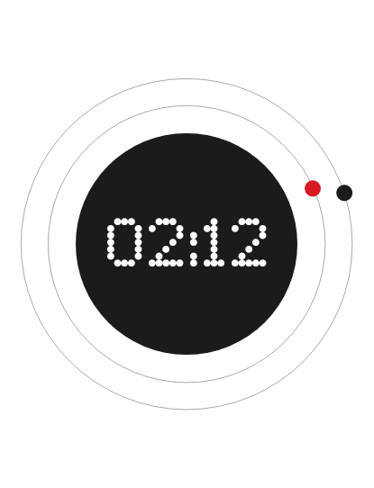 | 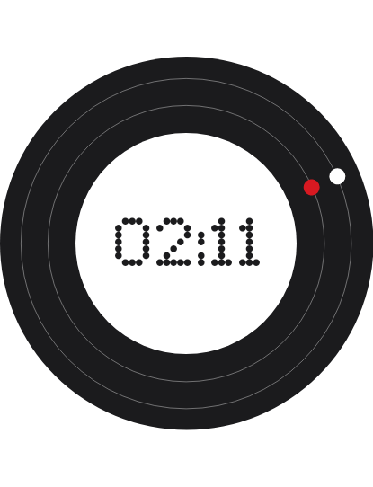 |
  > |-------|------|
  > | Light | Dark |
  >
  > Nothing OS themed Digital+Analog clock widget with dynamic themes.
  > 
  > **Key Feature:** Automatically adapts to system theme.

- ### [Nothing Future Clock](widgets/Nothing_Future_Clock.kwgt)
  > | 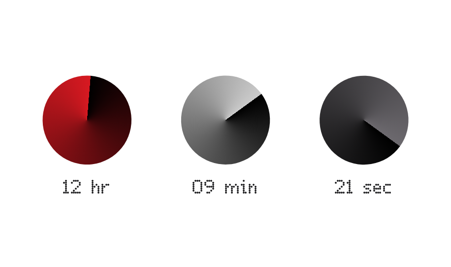 | 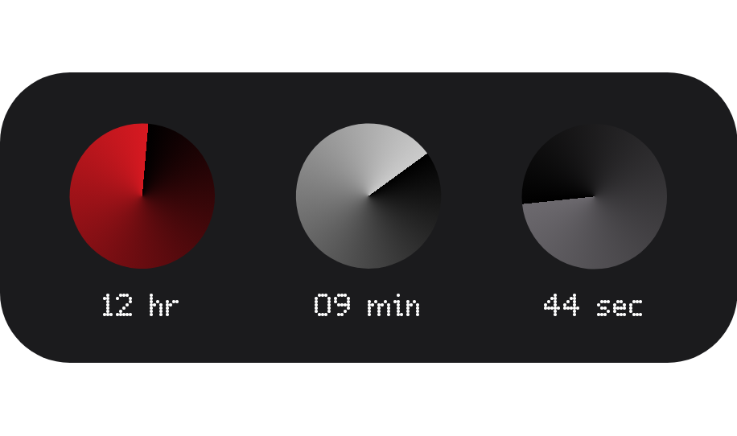 |
  > |-------|------|
  > | Light | Dark |
  >
  > Nothing OS themed futuristic clock widget with dynamic themes.
  > 
  > **Key Feature:** Automatically adapts to system theme.

- ### [Nothing Master Widget](widgets/Nothing_Master_Widget.kwgt)
  > | 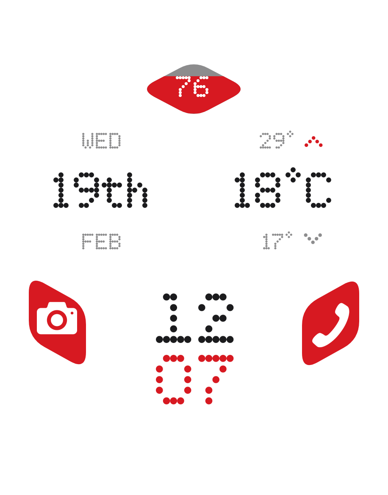 | 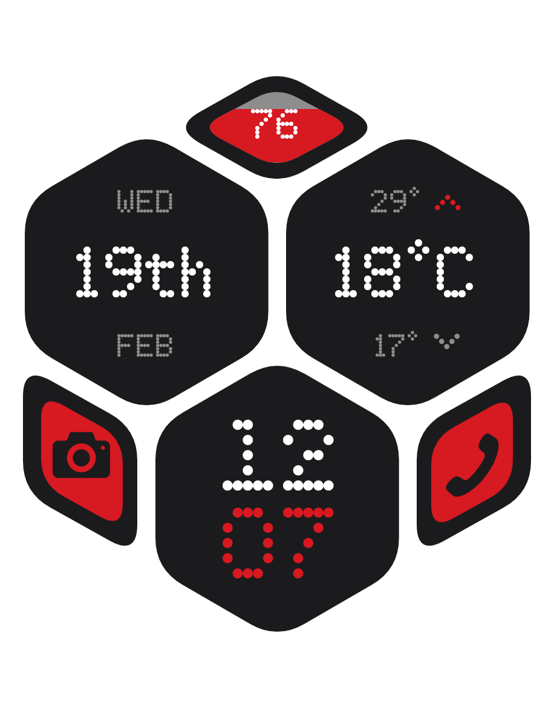 |
  > |-------|------|
  > | Light | Dark |
  >
  > Nothing OS themed MASTER widget All-in-one with dynamic themes.
  > 
  > **Key Feature:** Automatically adapts to system theme.

- ### [Nothing Media Player](widgets/Nothing_Media_Player.kwgt)
  > | 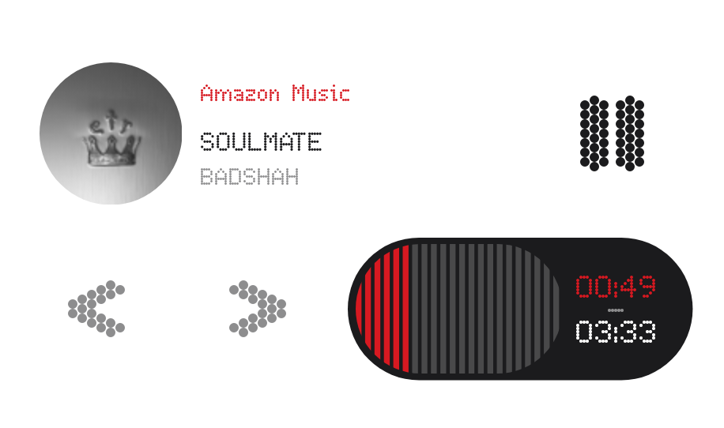 | 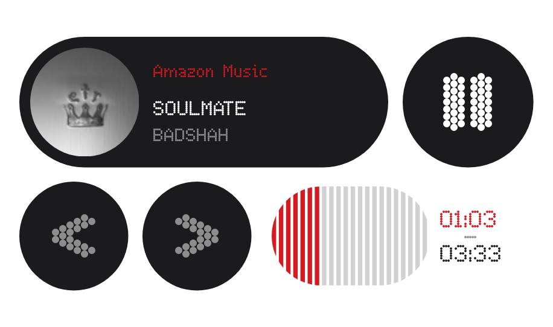 |
  > |-------|------|
  > | Light | Dark |
  >
  > Nothing OS themed Media Player widget with dynamic themes.
  > 
  > **Key Feature:** Automatically adapts to system theme.

- ### [Nothing Media Player2](widgets/Nothing_Media_Player2.kwgt)
  > | 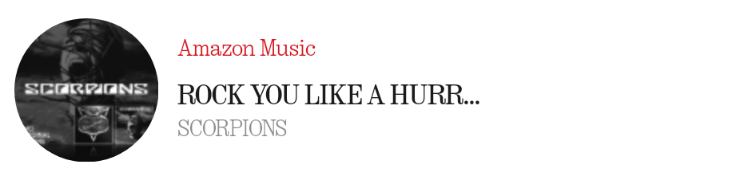 | 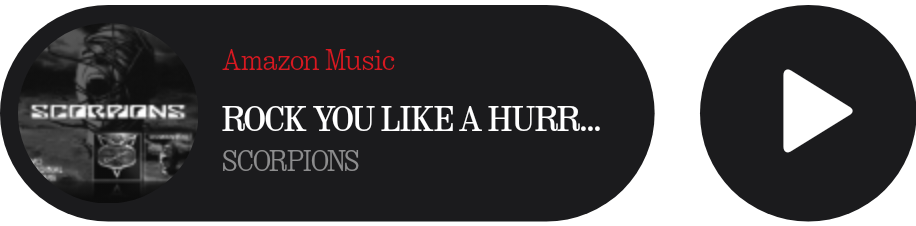 |
  > |-------|------|
  > | Light | Dark |
  >
  > A clean Nothing OS themed mini media player widget with dynamic themes.
  > 
  > **Key Feature:** Automatically adapts to system theme.

- ### [Nothing Media Player3](widgets/Nothing_Media_Player3.kwgt)
  > | 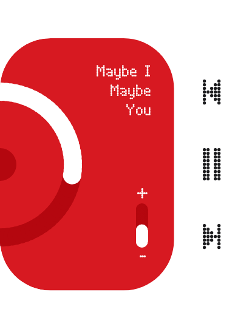 | 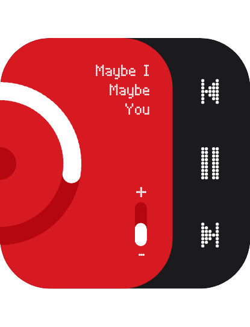 |
  > |-------|------|
  > | Light | Dark |
  >
  > A clean medial player widget widget with dynamic themes.
  > 
  > **Key Feature:** Minimalist and aesthetically pleasing design.

- ### [Nothing Mini Calender](widgets/Nothing_Mini_Calender.kwgt)
  > | 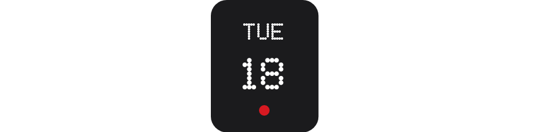 | 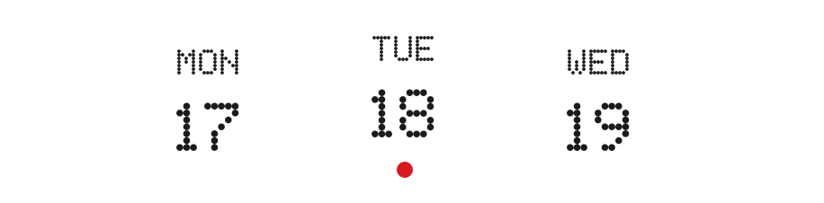 |
  > |-------|------|
  > | Light | Dark |
  >
  > A clean Nothing OS themed 5-day calender widget with dynamic themes.
  > 
  > **Key Feature:** Automatically adapts to wallpaper color Dark/Light [Note: Needs to be refreshed after changing wallpaper].

- ### [Nothing Sun Info](widgets/Nothing_Sun_Info.kwgt)
  > | 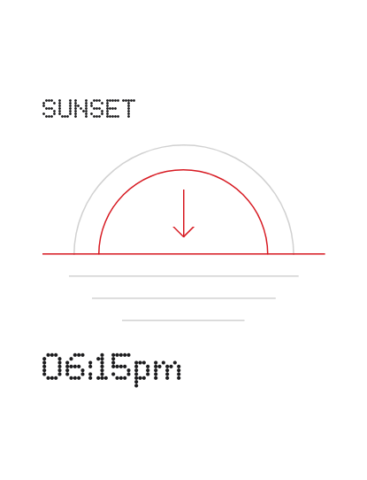 | 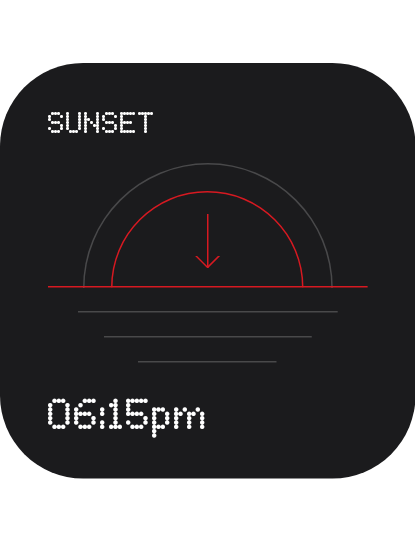 |
  > |-------|------|
  > | Light | Dark |
  >
  > Nothing OS themed sunrise and sunset time widget with dynamic themes.
  > 
  > **Key Feature:** Automatically adapts to system theme.

- ### [Nothing Temp](widgets/Nothing_Temp.kwgt)
  > | 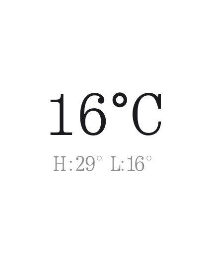 | 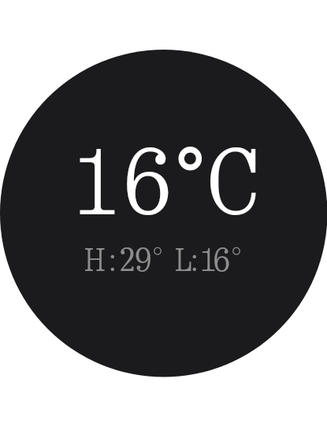 |
  > |-------|------|
  > | Light | Dark |
  >
  > Nothing OS themed temperature widget with dynamic themes.
  > 
  > **Key Feature:** Automatically adapts to system theme.

---

### **`Material You`** inspired widgets:

- ### [Material3 Expanded Media Player](widgets/Material3_Expanded_Media_Player.kwgt)
  
  > 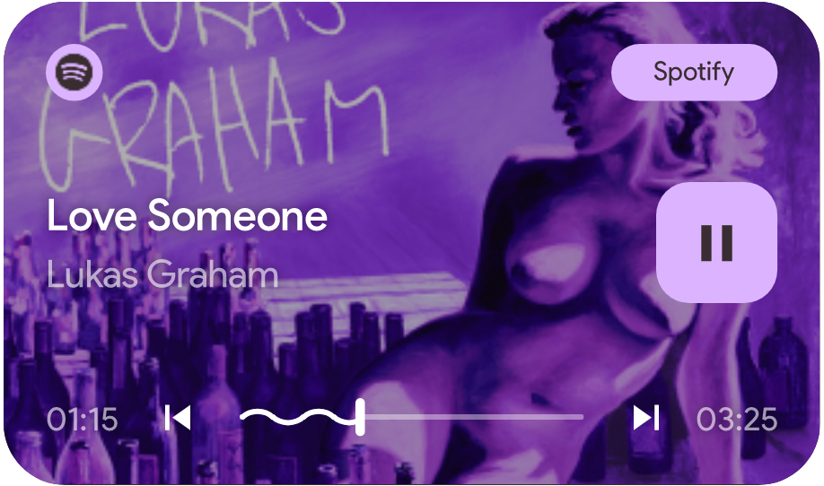
  >
  > A fully customizable media player widget based on Material You theme.
  > 
  > **Key Features:**  
  > - Dynamic accent color theming based on song cover.
  > - Integrated progress bar with wave effect.
  > - Top right container shows music app name.
  >

- ### [Material3 Media Player Output](widgets/Material3_Media_Player_Output.kwgt)
  > 
  > 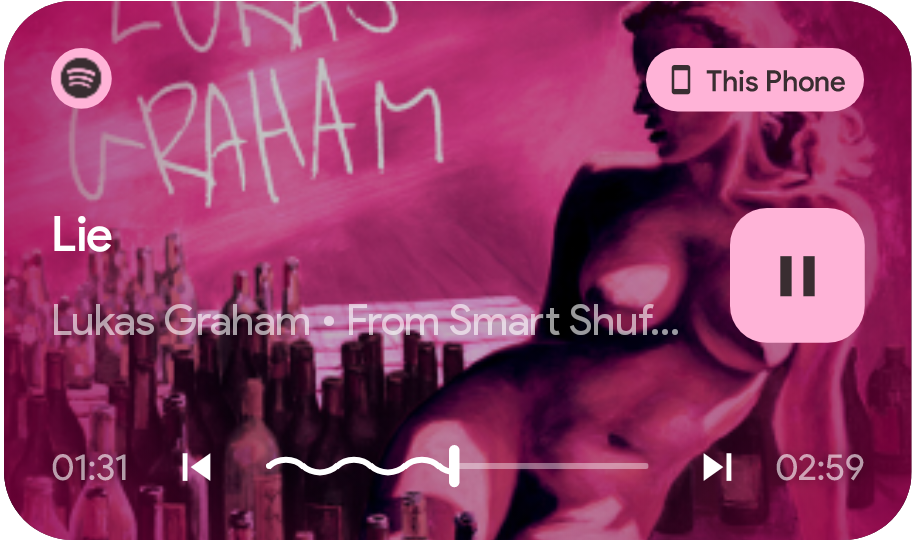
  >
  > - **Key Difference:**  Top right container shows *output* device (Phone/Bluetooth Device name).

- ### [Mini Media Player](widgets/Mini_Media_Player.kwgt)
  
  > 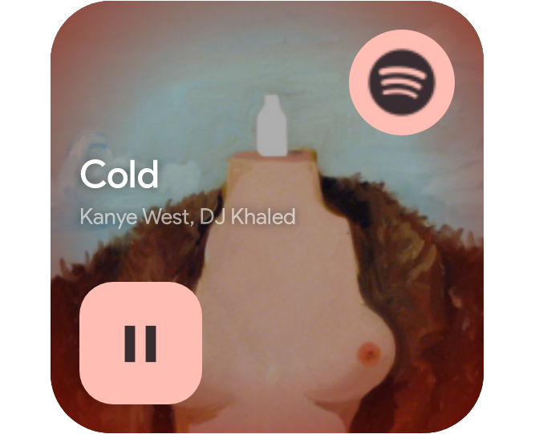
  >
  > A mini media player widget based on Material You theme.
  > 
  > **Key Feature:** Dynamic accent color theming based on song cover.

- ### [Minimal Media Player](widgets/Minimal_Media_Player.kwgt)
  > 
  >
  > Minimal media player widget based on Material You theme.
  >
  > - **Key Feature:** Dynamic accent color theming based on *system theme*.  
  >

- ### [Minimal Media Player 2](widgets/Minimal_Media_Player_2.kwgt)
  >
  > 
  >
  > - **Key Difference:**  Dynamic accent color theming based on *song cover*.  
  >

- ### [Minimal Media Player 3](widgets/Minimal_Media_Player_3.kwgt)
  >
  > 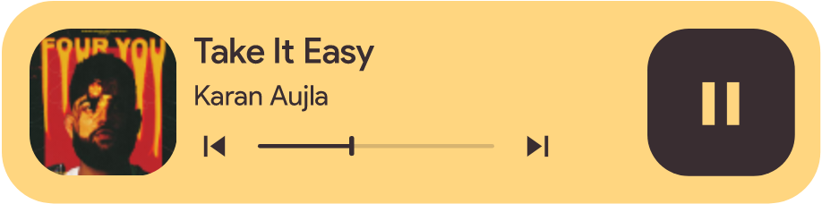
  >
  > - **Key Difference:**  Dynamic accent color theming based on *song cover*.  

- ### [Material Notification Widget](widgets/material_notification_widget.kwgt)


  > | 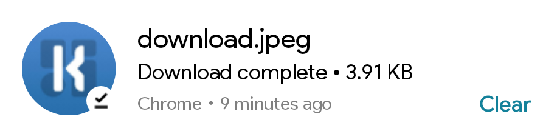  | 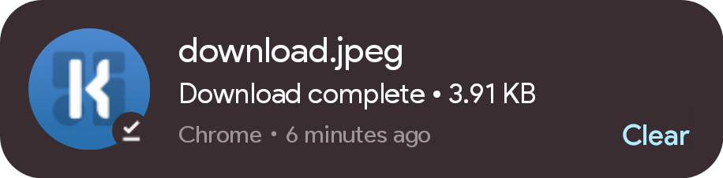  | 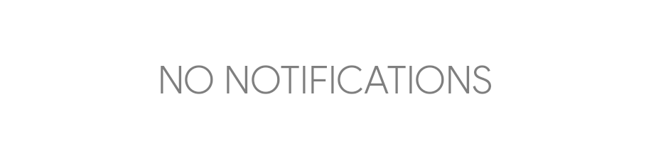  |
  > |-------|------|------|
  > | Light | Dark | Empty State|
  > 
  > Material themed widget that shows details of top-most notification.
  > 
  > **Key Features:** 
  > - Dynamic theme based on system theme (Dark/Light).
  > - Clear button removes the current notification.
  > - Clicking on the widget opens the notification.

---

### **`iOS`** inspired widgets:

- ### [iOS Battery Widget](widgets/iOS_Battery_Widget.kwgt)
  
  > 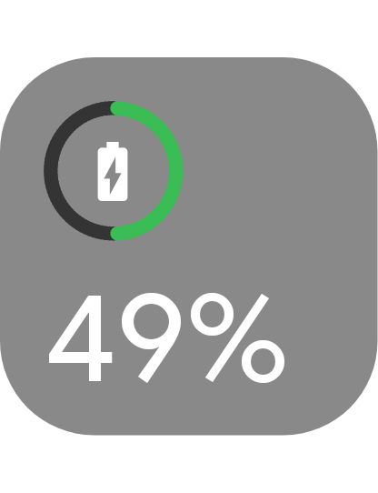
  >
  > A Battery widget inspired by Apple iOS.
  > 
  > **Key Feature:** Progress color and icon based on battery level and status (Charging or not).

More iOS widgtes coming sooon...

---

### Other **`COOL`** widgets:

- ### [Clean Time Date Info](widgets/Clean_Time_Date_Info.kwgt)
  
  > | 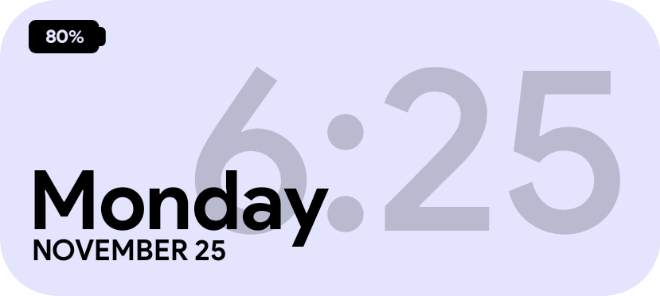 | 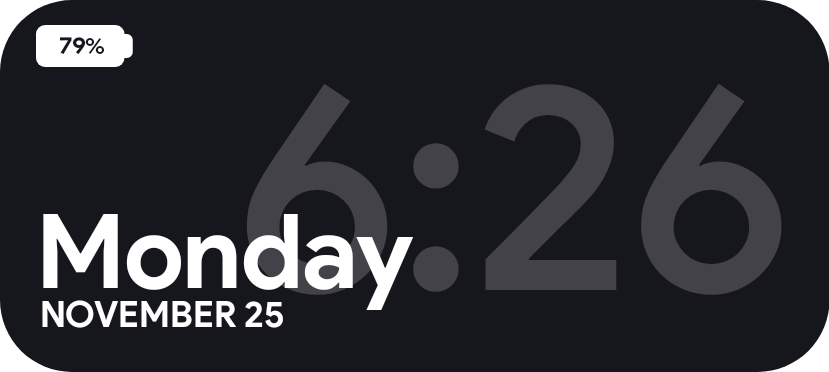 |
  > |-------|------|
  > | Light | Dark |
  >
  > A clean time, date and battery information widget.
  > 
  > **Key Feature:** Dynamic theme based on system theme.

- ### [Universal Media Player](widgets/Universal_Media_Player.kwgt)
  > 
  >
  > A fully customizable universal media player widget.
  > 
  > **Key Features:**  
  > - Blurred song cover fill in the background.  
  > - Integrated progress bar on the album cover border.
