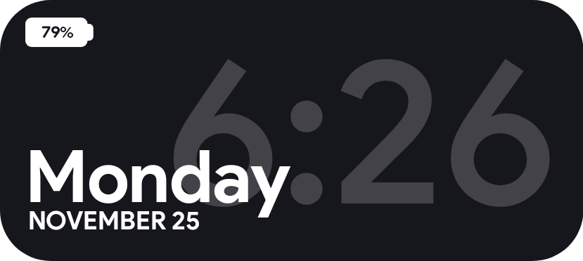
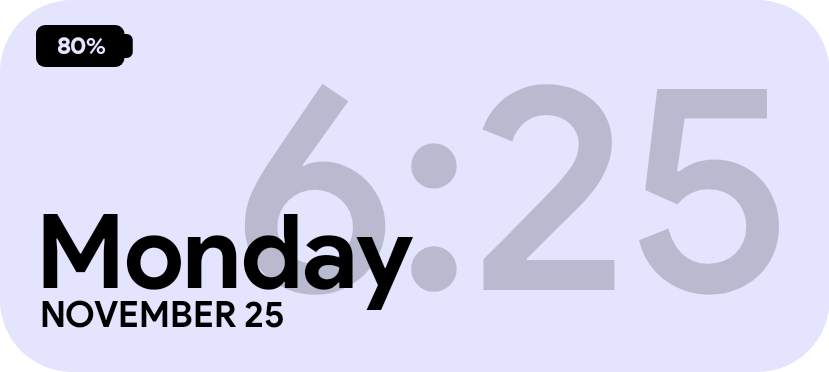

# KWGT Widgets

This repository hosts a collection of custom [**KWGT widgets**](https://docs.kustom.rocks/docs/downloads/download-kwgt/). New widgets will be added periodically as the collection evolves.

---

## Installation (Android)
1. **Download the files directly**: 
   - Navigate to the `widgets` folder.  
   - Tap on the `.kwgt` files and download them to your device (Optional: Move kwgt files at `Kwgt/Kustom/widgets`).
   - If applicable, download the custom font file as well from the `fonts` folder.
2. **Import into KWGT**:
   - Add a KWGT widget to your home screen.  
   - Open the **KWGT** app and select **Load Preset**.  
   - Navigate to the downloaded `.kwgt` file and import it (Not Required: If already at `Kwgt/Kustom/widgets`).

<details>
  <summary>Click to see instructions on installaiton via Computer.</summary>

1. **Download the files**:
   - Clone or download the repository:
     ```bash
     git clone https://github.com/AumGupta/KWGT-Widgets.git
     ```
   - Alternatively, download the repository as a `.zip` file from the GitHub page and extract it.
2. **Transfer to your Android device**:
   - Connect your device to your computer via USB or use a file transfer tool.  
   - Copy the `.kwgt` files from the `Widgets` folder to your device's storage at `Kwgt/Kustom/widgets`.  
   - If applicable, copy the custom font file (`.ttf` or `.otf`) to your device at `Kwgt/Kustom/fonts`.  
3. **Import into KWGT**:
   - Follow the same steps as [above](#for-android-users) for importing into the KWGT app and applying the font.
</details>

---

## Current Widgets

- ### [Univarsal Media Player](widgets/Universal_Media_Player.kwgt)
  
  > 
  >
  > A fully customizable universal media player widget.
  > 
  > **Key Features:**  
  > - Blurred song cover fill in the background.  
  > - Integrated progress bar on the album cover border.


- ### [Material You Media Player](widgets/Material3_Expanded_Media_Player.kwgt)
  
  > 
  >
  > A fully customizable media player widget based on Material You theme.
  > 
  > **Key Features:**  
  > - Dynamic accent color theming based on song cover.  
  > - Integrated progress bar with wave effect.

- ### [Mini Media Player](widgets/Mini_Media_Player.kwgt)
  
  > 
  >
  > A mini media player widget based on Material You theme.
  > 
  > **Key Features:**  
  > - Dynamic accent color theming based on song cover.

- ### [Minimal Media Player](widgets/Minimal_Media_Player.kwgt)
  > 
  >
  > Minimal media player widget based on Material You theme.
  >
  > - Key Feature: Dynamic accent color theming based on *system theme*.  
  >
  > [**Variant 2**](widgets/Minimal_Media_Player_2.kwgt)
  >
  >
  > 
  >
  > - Key Difference:  Dynamic accent color theming based on *song cover*.  
  >
  >[**Variant 3**](widgets/Minimal_Media_Player_3.kwgt)
  >
  > 
  >
  >
  > - Key Difference:  Dynamic accent color theming based on *song cover*.  

- ### [iOS Battery Widget](widgets/iOS_Battery_Widget.kwgt)
  
  > 
  >
  > A Battery widget inspired by Apple iOS.
  > 
  > **Key Features:**  
  > - Progress color and icon based on battery level and status (Charging or not).

- ### [Clean Time Date Info](widgets/Time_Date_Info.kwgt)
  
  >  
  >
  > Dark Mode
  >
  >  
  >
  > Light Mode
  >
  > A clean time, date and battery information widget.
  > 
  > - Key Feature: Dynamic theme based on system theme.

---

## Contribution  

Contributions are welcome. If you have ideas for new widgets or enhancements, feel free to:  
1. Fork the repository.  
2. Make the necessary changes.  
3. Submit a pull request for review.

---

## License  

This repository is licensed under the **MIT License**. See the [`LICENSE`](LICENSE) file for more details.

