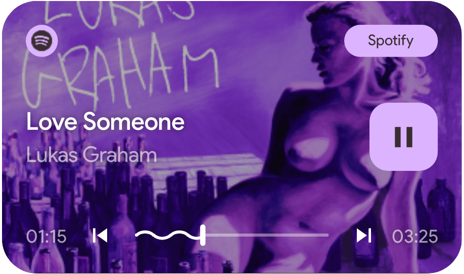

# KWGT Widgets

This repository hosts a collection of custom [**KWGT widgets**](https://docs.kustom.rocks/docs/downloads/download-kwgt/). New widgets will be added periodically as the collection evolves.

---

## Installation

1. Clone or download the repository to your local machine.  
2. Transfer the `.kwgt` files from the `Widgets` directory to your Android device.  
3. Transfer the custom font file (`.ttf` or `.otf`) to your device if required.  
4. Import the widget into the KWGT app:
   - Add a KWGT widget to your home screen.  
   - Open the **KWGT** app and load the desired widget from the `Widgets` folder.  
   - If prompted, apply the custom font within the widget settings.

---

## Current Widgets

- ### [Material3 Expanded Media Player](widgets/Material3_Expanded_Media_Player.kwgt)
  
  > 
  >
  > A fully customizable media player widget based on Material You theme.
  > 
  > **Key Features:**  
  > - Dynamic accent color theming based on song cover.  
  > - Integrated progress bar with wave effect.

---

## Contribution  

Contributions are welcome. If you have ideas for new widgets or enhancements, feel free to:  
1. Fork the repository.  
2. Make the necessary changes.  
3. Submit a pull request for review.

---

## License  

This repository is licensed under the **MIT License**. See the [`LICENSE`](LICENSE) file for more details.

